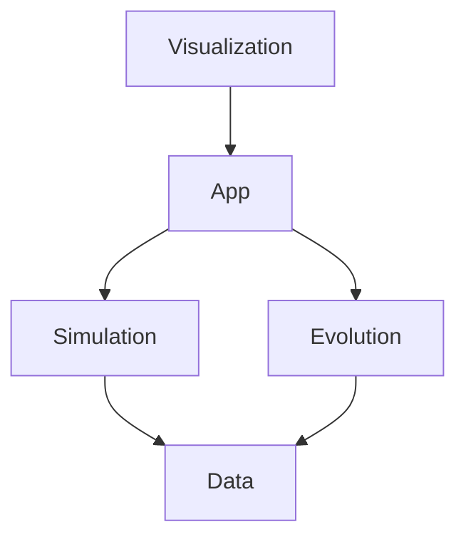

# MoonAI

A modular and extensible simulation platform for studying continuous evolutionary algorithms and neural network evolution through predator-prey dynamics.

**CMPE 491/492 - Senior Design Project | TED University**

**Website:** https://moon-aii.github.io/moonai/

**Team:**
- Caner Aras
- Emir Irkılata
- Oğuzhan Özkaya

**Supervisor:**
- Ayşenur Birtürk

**Jury Members:**
- Deniz Canturk
- Mehmet Evren Coskun

## Overview

MoonAI uses a predator-prey environment as a synthetic benchmark to evaluate evolutionary computation methods. Agents (predators and prey) are controlled by neural networks whose structure and weights evolve continuously through births and deaths using the **NeuroEvolution of Augmenting Topologies (NEAT)** algorithm.

The platform enables researchers to:

- Observe how neural network topologies emerge and grow in complexity through evolution
- Compare different genetic representations, mutation strategies, and selection methods
- Generate structured datasets for machine learning research without real-world data
- Visualize agent behavior and algorithm evolution in real time

## Key Features

- **Entity-Component-System Architecture** - Data-oriented design with sparse-set ECS, cache-friendly SoA memory layouts, and 5-10x performance improvement
- **NEAT Implementation** - Evolves both topology and weights of neural networks simultaneously
- **Real-Time Visualization** - SFML-based rendering with interactive controls and live NN activation display
- **GPU Acceleration** - CUDA backend for sensing, neural inference, and simulation systems in both visual and headless modes
- **Cross-Platform** - Runs on Linux and Windows with matched features and stable runtime behavior
- **Reproducible Experiments** - Seeded RNG with deterministic behavior within the CUDA execution path on a fixed runtime environment
- **Lua Configuration** - Define named experiments and parameter sweeps in `config.lua` without recompilation
- **Data Export** - CSV/JSON output (including optional per-step trajectories) compatible with Python analysis tools

## Architecture

MoonAI uses a **hybrid ECS/OOP architecture** optimized for evolutionary simulation, with a thin application layer orchestrating simulation, evolution, data export, and visualization.

### Core Philosophy

- **ECS for Simulation**: Agent state, physics, and interactions use data-oriented ECS for cache efficiency and GPU compatibility
- **OOP for Evolution**: NEAT algorithms (Genome, NeuralNetwork) remain object-oriented due to complex graph mutations and variable topology
- **Clean Boundaries**: `app` orchestrates module-level phases, while `simulation`, `evolution`, `data`, and `visualization` own their internal flow

### Why ECS?

Traditional OOP with `vector<unique_ptr<Agent>>` causes:
- Cache misses from pointer chasing
- Virtual dispatch overhead  
- Expensive GPU upload (field-by-field extraction)

ECS solves these with:
- Contiguous component arrays (Structure of Arrays)
- Direct GPU memory mapping (zero-copy transfers)
- GPU parallelization (CUDA)

### System Architecture



| Subsystem | Pattern | Library | Description |
|-----------|---------|---------|-------------|
| `src/core/` | OOP | `moonai_core` | Foundation code: shared types, config, Lua runtime, deterministic helpers, seeded RNG |
| `src/app/` | OOP | `moonai_app` | Application orchestration, main loop, runtime lifecycle, top-level step flow |
| `src/metrics/` | OOP | `moonai_metrics` | Metrics aggregation, CSV/JSON logging, report snapshots |
| `src/simulation/` | **ECS** | `moonai_simulation` | Sparse-set registry, SoA components, movement/sensing/combat/energy systems, spatial grid, and simulation CUDA backend |
| `src/evolution/` | OOP | `moonai_evolution` | NEAT genome, neural network, NetworkCache, speciation, mutation, crossover, and neural inference CUDA backend |
| `src/visualization/` | OOP | `moonai_visualization` | SFML window, renderer, and UI overlay |

### Performance

MoonAI achieves high performance through data-oriented ECS architecture:

**Key Optimizations:**
- **Cache-friendly layouts**: Structure-of-Arrays (SoA) component storage
- **Efficient GPU packing**: Contiguous memcpy from ECS to GPU buffers
- **Parallel systems**: CUDA parallelization on GPU
- **SIMD-ready**: Contiguous data enables AVX/AVX-512 vectorization

## Prerequisites

| Tool | Version | Required |
|------|---------|----------|
| C++ Compiler | C++17 support (GCC 9+, Clang 10+, MSVC 2019+) | Yes |
| CMake | 3.21+ | Yes |
| Ninja | any | Recommended |
| vcpkg | latest | Yes |
| just | any | Recommended |
| SFML | 3.x | Yes (via vcpkg) |
| CUDA Toolkit | 11.0+ | Yes |
| Python | 3.10+ with uv | For analysis only |

## Quick Start

### 1. Clone and enter the project

```bash
git clone https://github.com/moon-aii/moonai.git
cd moonai
```

### 2. Install vcpkg (if not already installed)

```bash
git clone https://github.com/microsoft/vcpkg.git ~/.vcpkg
~/.vcpkg/bootstrap-vcpkg.sh
export VCPKG_ROOT="$HOME/.vcpkg"  # Add to your shell profile
```

### 3. Configure and build

```bash
just configure
just build
```

Or manually:
```bash
cmake --preset linux-debug
cmake --build build/linux-debug --parallel
```

Run `just --list` to see all available commands.

### 4. Run the simulation

```bash
just run
```

## Build

There is one build type — it always bundles SFML visualization and requires CUDA at configure time:

| Command | Description |
|---------|-------------|
| `just build` | Debug build |
| `just release` | Optimized release build |

### CMake Options

| Option | Default | Description |
|--------|---------|-------------|
| `MOONAI_BUILD_TESTS` | `ON` | Build unit tests |
| `MOONAI_BUILD_PROFILER` | `OFF` | Build profiler executable |

### Visualization Controls

| Key | Action |
|-----|--------|
| `Space` | Pause / resume |
| `↑` / `↓` or `+` / `-` | Increase / decrease simulation speed |
| `.` | Step one step (while paused) |
| `S` | Save screenshot |
| `Esc` | Quit |
| Left-click | Select an agent (shows stats + live NN panel) |
| Right-click drag | Pan camera |
| Scroll wheel | Zoom |

When an agent is selected, its **vision range** (semi-transparent circle), **sensor lines** (connections to nearby agents and food), and **stats panel** (bottom-left) are automatically displayed. The agent controller currently receives 35 inputs: the 5 closest predators, prey, and food items as signed proximity-weighted `dx, dy` pairs, plus self energy, velocity `x/y`, and signed wall proximity on `x/y`. Missing targets are encoded as `0`, and closer objects produce larger absolute values in `[-1, 1]`. The **Network panel** (top-right) shows its topology with nodes colored by live activation value: blue (inactive, −1) → gray (zero) → orange (active, +1).

## Configuration

Configuration uses a single **`config.lua`** file at the project root. It returns a named table of experiments — every entry is a fully-specified run. The runtime injects C++ struct defaults as the `moonai_defaults` global (2000 agents on a 3000×3000 square world), so Lua only needs to override what it changes.

### `config.lua` structure

```lua
-- moonai_defaults is injected by the runtime (mirrors C++ SimulationConfig defaults)
-- Defaults: 500 predators, 1500 prey (2000 total), 3000×3000 square world, 1500 steps per report window
local function extend(t, overrides) ... end

-- Helper: scale world and food proportionally to population
local function scale_base(pred, prey)
    local total = pred + prey
    local default_total = moonai_defaults.predator_count + moonai_defaults.prey_count
    local factor = math.sqrt(total / default_total)
    return {
        predator_count = pred, prey_count = prey,
        grid_size = math.floor(moonai_defaults.grid_size * factor),
        food_count = math.floor(moonai_defaults.food_count * (total / default_total)),
    }
end

local conditions = {
    baseline = moonai_defaults,
    scale_5k = extend(moonai_defaults, scale_base(1250, 3750)),
    -- ...
}
local seeds = { 42, 43, 44, 45, 46 }

local experiments = {}
for name, cfg in pairs(conditions) do
    for _, seed in ipairs(seeds) do
        experiments[name .. "_seed" .. seed] = extend(cfg, { seed = seed, max_generations = 200 })
    end
end

experiments["default"] = moonai_defaults  -- auto-selected by 'just run'
return experiments
```

A single-entry file auto-selects without `--experiment`. The `default` entry (2000 agents) serves as the everyday run config.

### CLI flags

| Flag | Purpose |
|------|---------|
| `-c, --config <path>` | Path to Lua config file (default: `config.lua`) |
| `-n, --steps <n>` | Override max steps (`0` = infinite) |
| `--headless` | Run without visualization |
| `-v, --verbose` | Enable debug logging |
| `--experiment <name>` | Select one experiment by name |
| `--all` | Run all experiments sequentially (headless only) |
| `--list` | List experiment names and exit |
| `--name <name>` | Override output directory name |
| `--validate` | Load + validate config, print result, exit |
| `-h, --help` | Show CLI help |

### Examples

```bash
just run                                              # GUI with default config
just run -- --headless                                # Headless mode
just run -- --experiment mut_low_seed42 --headless    # One experiment
just run-release -- --all --headless                  # Full batch (release build)
```

Set `seed` to `0` for random seed, or a fixed value for reproducible experiments in `config.lua`.

## Running Experiments

### Quick start (full pipeline)

```bash
just experiment             # runs all experiments + generates report
```

### Step by step

**1. Build release binary**
```bash
just release
```

**2. List available experiments**
```bash
just list-experiments       # shows all experiments in config.lua
```

**3. Run experiments**
```bash
just experiment-run         # 275 seeded runs + default entry → output/
```

**4. Set up Python and generate analysis**
```bash
just setup-python           # installs simulation + profiler analysis dependencies via uv
just experiment-analyse     # reads output/, writes a self-contained HTML report
```

### Simulation Output

Each run writes to `output/{experiment_name}/` (named experiments) or `output/YYYYMMDD_HHMMSS_seedN/` (anonymous runs):

| File | Contents |
|------|----------|
| `config.json` | Full config snapshot for this run |
| `stats.csv` | One row per report interval sample with current state plus cumulative event totals: `step, predator_count, prey_count, predator_births, prey_births, predator_deaths, prey_deaths, predator_species, prey_species, avg_predator_complexity, avg_prey_complexity, avg_predator_energy, avg_prey_energy, max_predator_generation, avg_predator_generation, max_prey_generation, avg_prey_generation` |
| `species.csv` | One row per species per generation: `step, population, species_id, size, avg_complexity` |
| `genomes.json` | Representative genome snapshots (nodes + connections JSON) |

### Analysis

The Python analysis tool generates self-contained HTML report for all qualifying runs in `output/`.

```bash
just experiment-analyse
```

Internally this runs the packaged analysis entry point from `analysis/`:

```bash
cd analysis && uv run moonai-analysis
```

The analysis writes a timestamped report to `analysis/output/`, for example `report_20260324_154233.html`.

The generated HTML is fully self-contained: it embeds all plots and report data directly into a single file, including:

- per-condition plots for population, species, complexity, and representative-genome topology
- cross-condition comparison plots using seed-aggregated statistics
- the grouped summary table at the final sampled generation
- skipped-run information for incomplete or invalid runs
- inline styling and navigation so the report opens directly in a browser without side files

The analysis code is structured as a small package under `analysis/moonai_analysis/`:

- `pipeline.py` orchestrates the full analysis run
- `io.py` discovers runs and loads CSV/JSON data
- `labels.py` groups runs into experiment conditions
- `plots.py` generates embedded per-condition and comparison figures
- `genome.py` renders embedded representative-genome topology diagrams
- `summary.py` prepares structured summary data for the report
- `html_report.py` renders the final self-contained HTML document
- `templates/report.html` defines the HTML report layout

### Experiment conditions

55 conditions defined in `config.lua` across 9 groups, each × 5 seeds = **275 seeded runs**, plus the unseeded `default` entry.

The default baseline is 2000 agents (500 predators, 1500 prey) on a 3000×3000 square world with 1500 steps per report window. Scaled experiments use `scale_base()` to maintain agent density by proportionally adjusting world size and food count.

- Group A — Baseline sweeps (2K agents)
- Group B — Scale experiments (proportional world)
- Group C — Parameter sweeps at 5K
- Group D — Parameter sweeps at 10K
- Group E — World density (5K agents, varying world size)
- Group F — Reporting window length
- Group G — Energy / resource dynamics
- Group H — Agent speed / interaction range (5K)
- Group I — Topology complexity

### Large-scale experiments

Experiments with 5K+ agents require significant compute. Recommendations:

- **Release build** (`just release`) for 2-5x faster simulation
- **Headless mode** (`--headless`) disables gui for maximum throughput
- **Memory**: ~4 GB RAM for 10K agents, ~8 GB for 20K agents
- **VRAM**: ~512 MB for 10K agents, ~1 GB for 20K agents
- Running all 330 experiments sequentially takes significant time; use `--experiment` to run specific conditions or parallelize across machines

## Profiler

The profiler executable is available but not built by default (set `MOONAI_BUILD_PROFILER=ON` to enable). It captures detailed per-frame timing data for performance analysis.

### Running the Profiler

```bash
just profile-run                                     # Run with defaults (300 frames, 6 seeds)
just profile-run --frames 300                        # Custom frame count
just profile-run --name mytest --output-dir results  # Custom name and output
```

**CLI Arguments:**

| Flag | Default | Description |
|------|---------|-------------|
| `--frames N` | 300 | Number of frames to capture per run |
| `--name <name>` | profile | Experiment name (used in output filename) |
| `--output-dir <path>` | output/profiles | Output directory |

Each profiler run writes a single JSON file to `output/profiles/`:

| File | Contents |
|------|----------|
| `YYYY-MM-DD_HH-MM-SS_name.json` | Suite manifest with per-frame timing data from all seeds |

The profiler drops the fastest and slowest runs by average frame time, and reports aggregate timing data from the remaining runs. Standard simulation builds do not include profiler instrumentation.

### Generating Reports

```bash
just profile-analyse    # Generate HTML report from latest profile run
just profile            # Full pipeline: run profiler and build report
```

The profiler writes a timestamped self-contained HTML report to `profiler/output/`, for example `profile_report_20260324_154233.html`.

The profiler package lives under `profiler/moonai_profiler/` and includes:

- `pipeline.py` for orchestration
- `io.py` for discovering and validating profile runs
- `plots.py` for embedded timing charts
- `html_report.py` for rendering
- `templates/report.html` for layout

## Development

### Commands

```bash
# Generate compile_commands.json for your IDE/LSP
just compdb

# Run tests
just test              # basic run
just test --verbose    # verbose output
just test -R GpuTest   # filter tests

# Code formatting and linting
just lint              # Auto-format and run static analysis
```

### C++ Code Style

MoonAI follows the **LLVM coding style** (2-space indentation, LLVM brace breaking, etc.).

#### Style Configuration

- **`.clang-format`** — LLVM-based configuration in project root
  - 2-space indentation
  - 120 column limit
  - Attached braces
  - Left-aligned pointers/references

#### Code Style Conventions

| Convention | Rule |
|------------|------|
| Namespace | `moonai` |
| Include paths | Relative to `src/`: `#include "core/types.hpp"` |
| Header guards | `#pragma once` |
| Member variables | Trailing underscore: `speed_`, `position_` |
| Functions / variables | `snake_case` |
| Classes / structs | `PascalCase` |

## Project Structure

```
moonai/
├── CMakeLists.txt              # Root CMake configuration
├── CMakePresets.json           # Build presets for Linux/Windows
├── vcpkg.json                  # Dependency manifest
├── justfile                    # Project commands
├── config.lua                  # Unified config: default run + experiment matrix
├── .clang-format               # LLVM code style configuration
├── .clang-tidy                 # Static analysis configuration
├── src/
│   ├── main.cpp                # Entry point: CLI parsing and app startup
│   ├── profiler_main.cpp       # Profiler executable entry point
│   ├── app/                    # Application orchestration layer
│   ├── core/                   # Foundation code: types, config, Lua runtime, RNG
│   ├── metrics/                # Metrics aggregation and CSV/JSON logging
│   ├── simulation/             # ECS-based simulation core
│   ├── evolution/              # NEAT evolution implementation
│   └── visualization/          # SFML rendering and UI
├── tests/                      # Google Test unit tests
├── analysis/                   # Python simulation analysis package
├── profiler/                   # Python profiler analysis package
├── docs/reports/               # Project documents
├── web/                        # GitHub Pages website
└── .github/workflows/          # CI/CD pipelines
```
