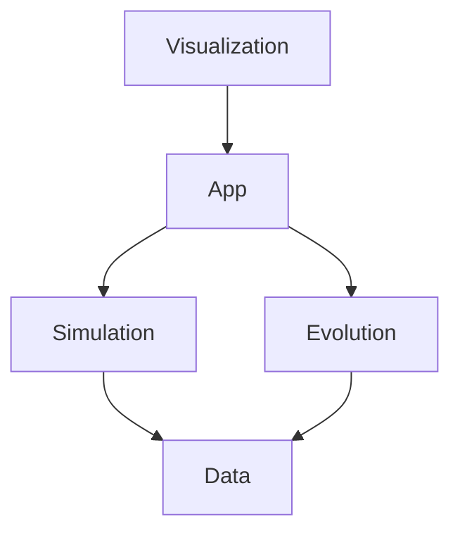

# Architecture

MoonAI uses a **hybrid ECS/OOP architecture** optimized for evolutionary simulation, with a thin application layer orchestrating simulation, evolution, data export, and visualization.

### Core Philosophy

- **ECS for Simulation**: Agent state, physics, and interactions use data-oriented ECS for cache efficiency and GPU compatibility
- **OOP for Evolution**: NEAT algorithms (Genome, NeuralNetwork) remain object-oriented due to complex graph mutations and variable topology
- **Clean Boundaries**: `app` orchestrates module-level phases, while `simulation`, `evolution`, `data`, and `visualization` own their internal flow

### Why ECS?

Traditional OOP with `vector<unique_ptr<Agent>>` causes:
- Cache misses from pointer chasing
- Virtual dispatch overhead  
- Expensive GPU upload (field-by-field extraction)

ECS solves these with:
- Contiguous component arrays (Structure of Arrays)
- Direct GPU memory mapping (zero-copy transfers)
- GPU parallelization (CUDA)

### System Architecture

| Subsystem | Pattern | Library | Description |
|-----------|---------|---------|-------------|
| `src/core/` | OOP | `moonai_core` | Foundation code: shared types, config, Lua runtime, deterministic helpers, seeded RNG |
| `src/app/` | OOP | `moonai_app` | Application orchestration, main loop, runtime lifecycle, top-level step flow |
| `src/metrics/` | OOP | `moonai_metrics` | Metrics aggregation, CSV/JSON logging, report snapshots |
| `src/simulation/` | **ECS** | `moonai_simulation` | Sparse-set registry, SoA components, movement/sensing/combat/energy systems, spatial grid, and simulation CUDA backend |
| `src/evolution/` | OOP | `moonai_evolution` | NEAT genome, neural network, NetworkCache, speciation, mutation, crossover, and neural inference CUDA backend |
| `src/visualization/` | OOP | `moonai_visualization` | SFML window, renderer, and UI overlay |

### Performance

MoonAI achieves high performance through data-oriented ECS architecture:

<!-- **Key Optimizations:** -->
- **Cache-friendly layouts**: Structure-of-Arrays (SoA) component storage
- **Efficient GPU packing**: Contiguous memcpy from ECS to GPU buffers
- **Parallel systems**: CUDA parallelization on GPU
- **SIMD-ready**: Contiguous data enables AVX/AVX-512 vectorization
