# Architecture

MoonAI is a CUDA-first predator-prey simulation platform with NEAT-based neural evolution.
It uses ECS-style SoA data for simulation state and GPU kernels, and OOP-style graph/genetics logic for NEAT mutation, crossover, and speciation.

The diagrams below describe execution, dataflow, layouts, ECS, spatial indexing, NEAT, GPU execution, and module dependencies.

## 1. Runtime Architecture

Primary references: `src/main.cpp`, `src/app/app.cpp`, `src/core/app_state.hpp`, `src/simulation/batch.cu`, `src/evolution/evolution_manager.cpp`.

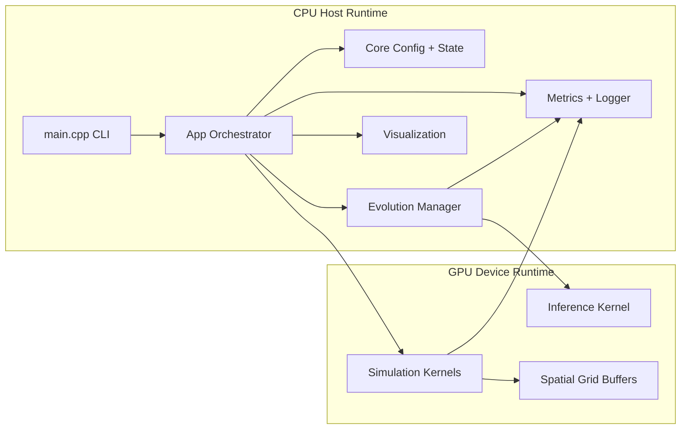

## 2. Execution and Dataflow

### 2.1 Program Entry and Experiment Selection

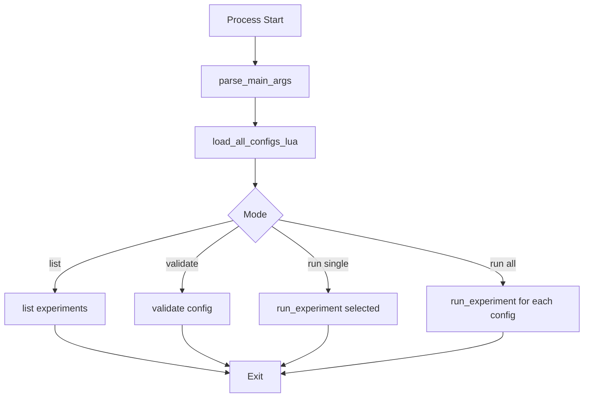

### 2.2 App Construction Path

Source: `src/app/app.cpp:33-72`.

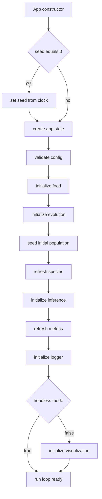

### 2.3 Main Loop

Source: `src/app/app.cpp:138-194`.

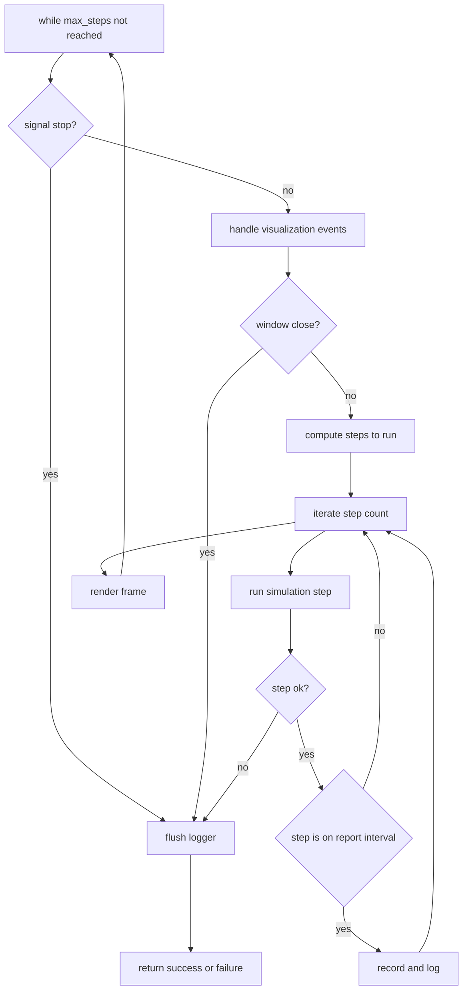

### 2.4 Five-Phase Step Pipeline

Sources: `src/app/app.cpp:74-98`, `src/simulation/simulation.cpp:159-221`, `src/evolution/evolution_manager.cpp:124-127`, `src/evolution/evolution_manager.cpp:368-373`.

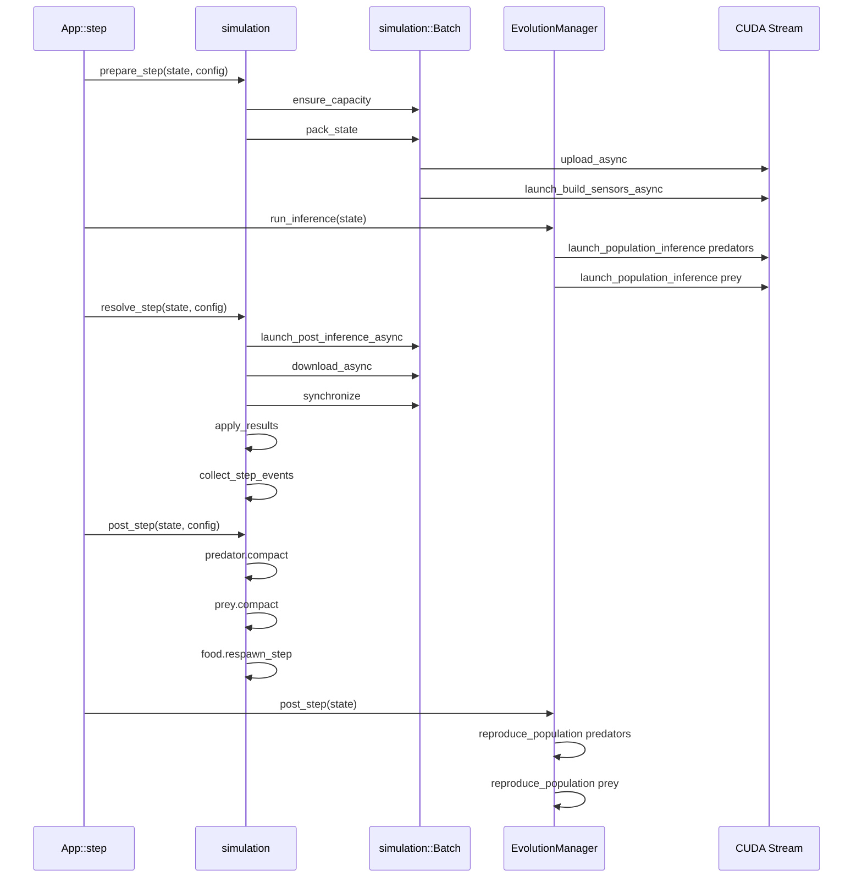

## 3. Failure and Recovery Paths

### 3.1 Step Failure Propagation

Sources: `src/simulation/simulation.cpp:168-176`, `src/simulation/simulation.cpp:192-209`, `src/evolution/evolution_manager.cpp:391-410`, `src/app/app.cpp:167-187`.

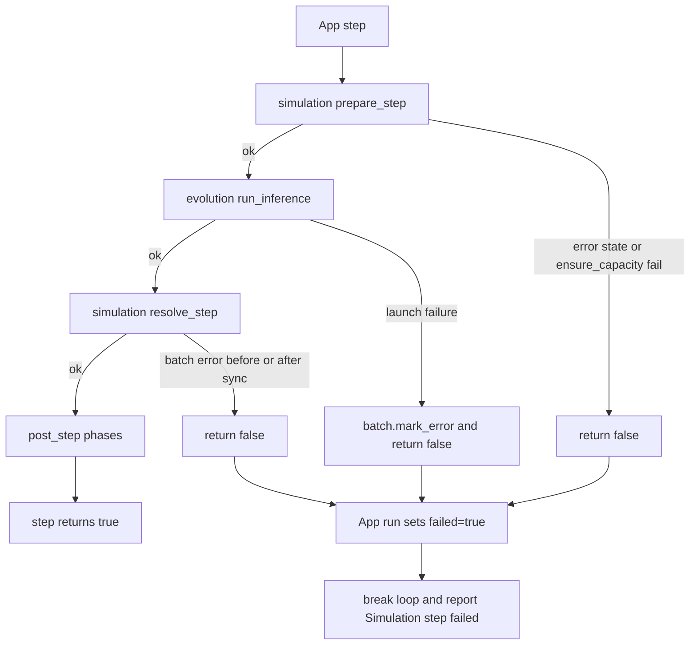

## 4. Critical Data Layouts

### 4.1 AppState Composition

Source: `src/core/app_state.hpp:111-124`.

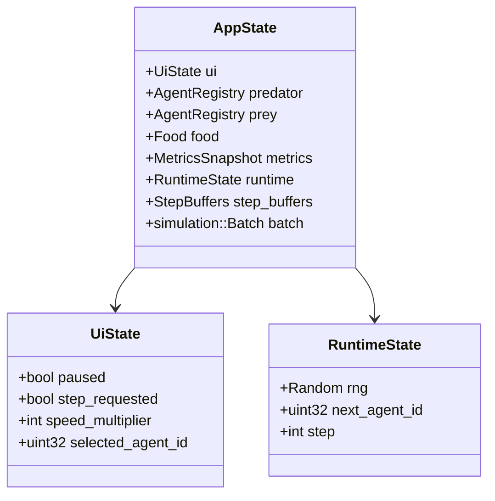

### 4.2 AgentRegistry SoA Layout

Source: `src/core/app_state.hpp:38-67`.

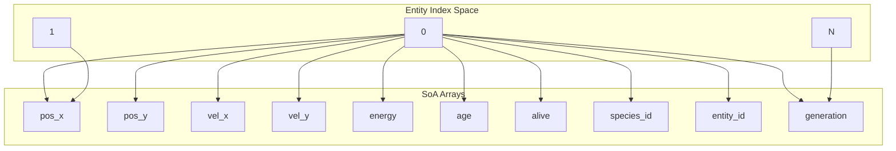

### 4.3 Registry API Semantics

Sources: `src/core/app_state.cpp:50-56`.

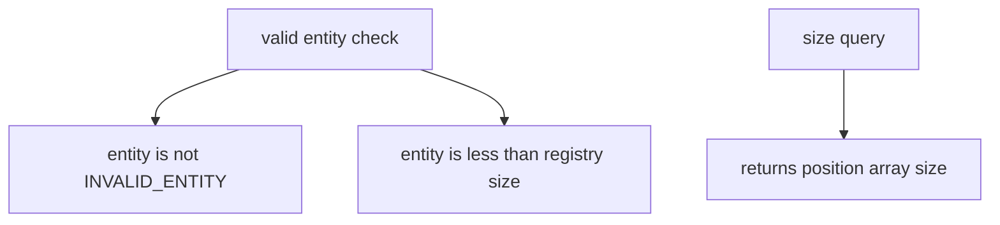

### 4.4 Host and Device Buffers

Source: `src/simulation/buffers.hpp`.

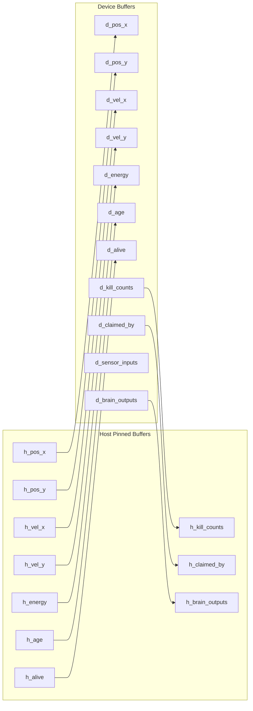

### 4.5 Spatial Entry Layout

Source: `src/simulation/layout.hpp:5-17`.

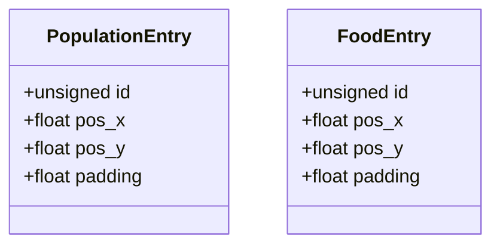

## 5. ECS Architecture

### 5.1 Lifecycle for Agents

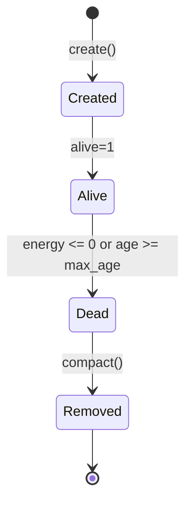

### 5.2 Food Lifecycle

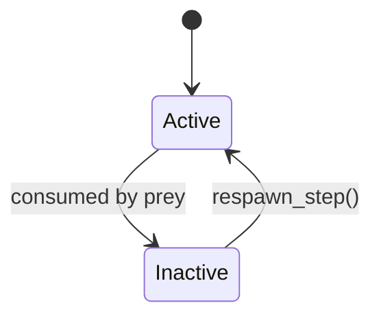

### 5.3 Compaction Procedure

Source: `src/core/app_state.cpp:62-98`.

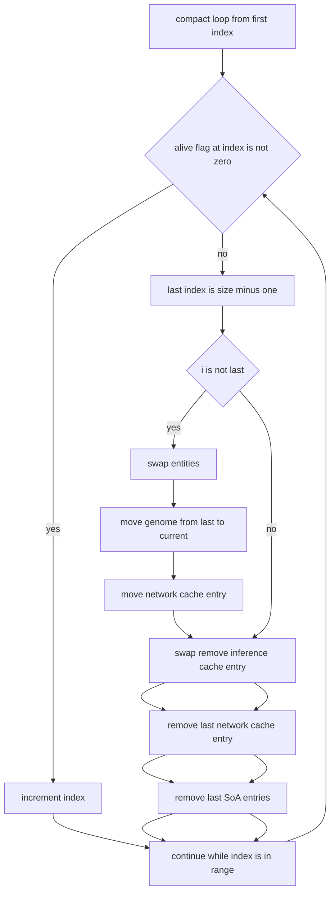

### 5.4 ECS + Evolution Cache Consistency

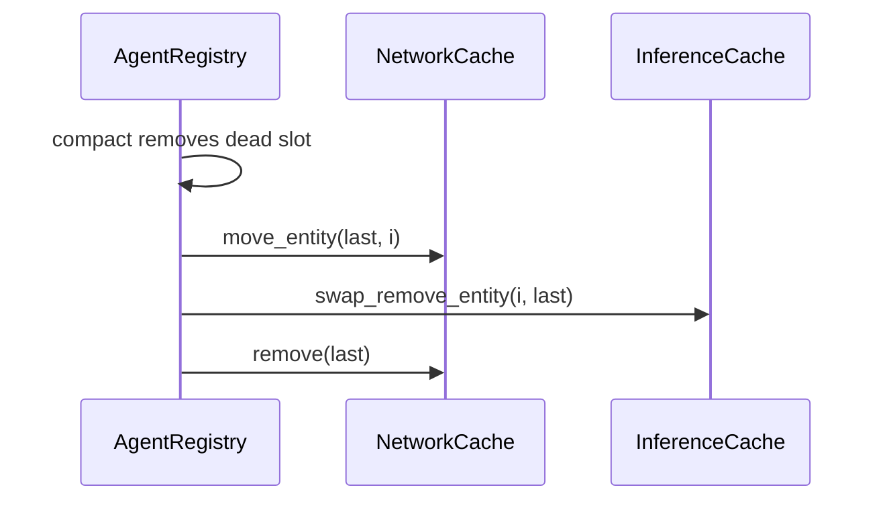

## 6. Spatial Grid

### 6.1 Grid Resources

Source: `src/simulation/batch.hpp:91-109`.

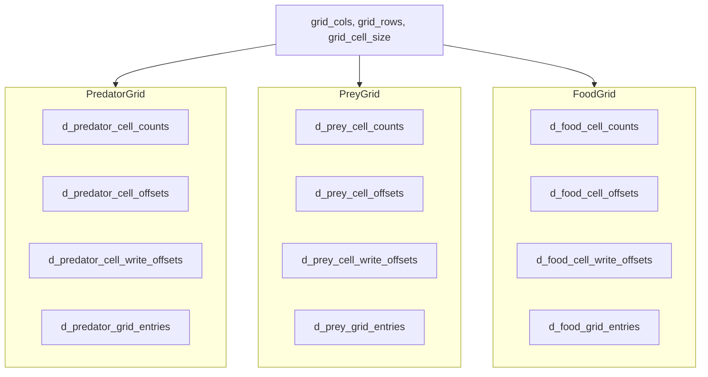

### 6.2 Count-Scan-Scatter Build

Source: `src/simulation/batch.cu:131-192`, `src/simulation/batch.cu:671-776`.


### 6.3 Sensor Query Pipeline

Source: `src/simulation/batch.cu:194-325`.

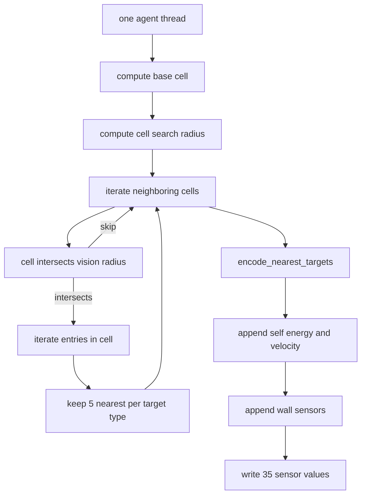

### 6.4 Sensor Layout (35 Inputs)

Sources: `src/core/types.hpp:21`, `src/simulation/batch.cu:16-29`.

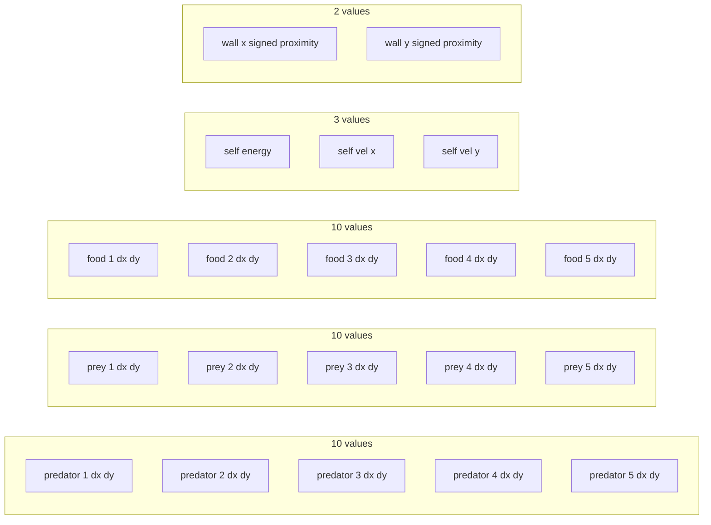

## 7. NEAT Evolution System

### 7.1 Genome Model

Source: `src/evolution/genome.hpp`.

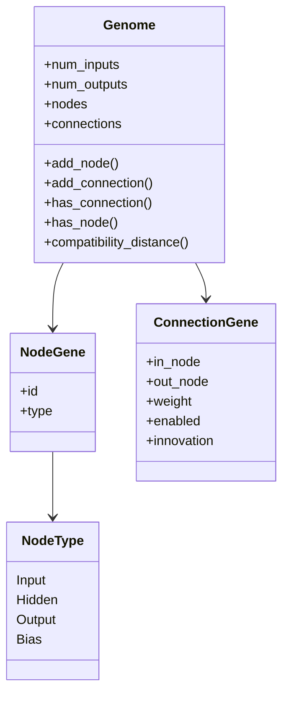

### 7.2 Neural Compilation and Launch Path

Sources: `src/evolution/network_cache.hpp`, `src/evolution/inference_cache.hpp`, `src/evolution/evolution_manager.cpp:377-388`.

```mermaid
flowchart LR
  GenomeIn[Genome]
  BuildNN[NeuralNetwork construction]
  Compile[CompiledNetwork arrays]
  NetCache[NetworkCache assign]
  InfCache[InferenceCache prepare_for_launch]
  Launch[kernel_neural_inference]

  GenomeIn --> BuildNN --> Compile --> NetCache --> InfCache --> Launch
```

### 7.3 Innovation Tracker

Source: `src/evolution/mutation.cpp:30-55`.

```mermaid
flowchart TB
  Pair[node pair in_node out_node]
  HasInnov{innovation exists}
  ReturnInnov[return existing innovation]
  NewInnov[create innovation_counter++]
  SplitPair[split pair in_node out_node]
  HasSplit{split node id exists}
  ReturnSplit[return existing split node id]
  NewSplit[create next_node_id]

  Pair --> HasInnov
  HasInnov -->|yes| ReturnInnov
  HasInnov -->|no| NewInnov

  SplitPair --> HasSplit
  HasSplit -->|yes| ReturnSplit
  HasSplit -->|no| NewSplit
```

### 7.4 Mutation Pipeline

Source: `src/evolution/mutation.cpp:178-198`.

```mermaid
flowchart TB
  Start[Mutation::mutate]
  Weights{rng < mutation_rate}
  AddConn{rng < add_connection_rate}
  AddNode{rng < add_node_rate}
  DelConn{rng < delete_connection_rate}
  EnsureEnabled[if none enabled then enable random connection]
  End[return mutated genome]

  Start --> Weights --> AddConn --> AddNode --> DelConn --> EnsureEnabled --> End
```

### 7.5 Crossover Path

Source: `src/evolution/crossover.cpp:8-76`.

```mermaid
flowchart TB
  Parents[parent A and parent B]
  Index[map genes by innovation]
  Iterate[iterate all innovation ids]
  Match{gene in both parents}
  MatchPick[pick one parent gene]
  Disabled{either gene disabled}
  DisableRule[75 percent chance child gene disabled]
  Single{gene in one parent only}
  KeepSingle[50 percent chance keep]
  EnsureOne[if child empty choose one random gene]
  HiddenNodes[add required hidden nodes]
  Child[child genome]

  Parents --> Index --> Iterate --> Match
  Match -->|yes| MatchPick --> Disabled
  Disabled -->|yes| DisableRule --> Single
  Disabled -->|no| Single
  Match -->|no| Single
  Single --> KeepSingle --> Iterate
  Iterate --> EnsureOne --> HiddenNodes --> Child
```

### 7.6 Speciation Path

Sources: `src/evolution/species.hpp`, `src/evolution/evolution_manager.cpp:253-300`.

```mermaid
flowchart TB
  Clear[clear all species members]
  ForGenome[for each genome]
  FindCompat[check species representative compatibility]
  Compatible{"distance is at most threshold"}
  AddMember[add member to species]
  NewSpecies[create new species with representative]
  WriteId[write species_id for entity]
  Refresh[refresh species summaries]
  Prune[remove empty species]

  Formula[distance uses excess disjoint normalization and weight diff terms]

  Clear --> ForGenome --> FindCompat --> Compatible
  Compatible -->|yes| AddMember --> WriteId --> ForGenome
  Compatible -->|no| NewSpecies --> WriteId --> ForGenome
  ForGenome --> Refresh --> Prune
  Formula --> FindCompat
```

### 7.7 Reproduction Path

Source: `src/evolution/evolution_manager.cpp:310-365`.

```mermaid
flowchart TB
  BuildGrid[DenseReproductionGrid build]
  ForEntity[for each entity]
  EnergyCheck{energy >= reproduction threshold}
  UsedCheck{already used this step}
  CandidateSearch[search nearby candidates within mate_range]
  MateFound{best mate found}
  Offspring[create_offspring]
  ChildGenome[crossover and mutation]
  ChildCache[network_cache assign and inference_cache add_entity]
  EnergyCost[subtract reproduction energy cost from both parents]
  MarkUsed[mark both parents used]

  BuildGrid --> ForEntity --> EnergyCheck
  EnergyCheck -->|no| ForEntity
  EnergyCheck -->|yes| UsedCheck
  UsedCheck -->|yes| ForEntity
  UsedCheck -->|no| CandidateSearch --> MateFound
  MateFound -->|no| ForEntity
  MateFound -->|yes| Offspring --> ChildGenome --> ChildCache --> EnergyCost --> MarkUsed --> ForEntity
```

## 8. GPU Execution

### 8.1 Simulation Kernel Order

Source: `src/simulation/batch.cu:778-849`.

```mermaid
flowchart LR
  VPred[kernel_update_vitals predators]
  VPrey[kernel_update_vitals prey]
  ClaimFood[kernel_claim_food]
  FinalFood[kernel_finalize_food]
  ClaimCombat[kernel_claim_combat]
  FinalCombat[kernel_finalize_combat]
  ClampPred[kernel_clamp_energy predators]
  ClampPrey[kernel_clamp_energy prey]
  MovePred[kernel_apply_movement predators]
  MovePrey[kernel_apply_movement prey]

  VPred --> VPrey --> ClaimFood --> FinalFood --> ClaimCombat --> FinalCombat --> ClampPred --> ClampPrey --> MovePred --> MovePrey
```

### 8.2 Inference Kernel Dataflow

Sources: `src/evolution/inference_cache.cu:39-83`, `src/evolution/inference_cache.hpp:19-31`.

```mermaid
flowchart TB
  Slot[network slot thread]
  Desc[NetworkDescriptor offsets]
  LoadIn[load SENSOR_COUNT inputs]
  Bias[set bias node to 1]
  EvalLoop[for node in eval_order]
  Sum[sum incoming weighted edges]
  Act[apply tanh]
  WriteOut[write OUTPUT_COUNT outputs]

  Slot --> Desc --> LoadIn --> Bias --> EvalLoop --> Sum --> Act --> EvalLoop --> WriteOut
```

### 8.3 Host-Device Transfer Timeline

Sources: `src/simulation/simulation.cpp:179-184`, `src/simulation/simulation.cpp:202-205`, `src/simulation/buffers.cu`.

```mermaid
sequenceDiagram
  participant CPU
  participant Stream as CUDA stream

  CPU->>Stream: upload_async predator, prey, food
  CPU->>Stream: launch_build_sensors_async
  CPU->>Stream: launch_inference_async predator and prey
  CPU->>Stream: launch_post_inference_async
  CPU->>Stream: download_async predator, prey, food
  CPU->>Stream: synchronize
  CPU->>CPU: apply_results and collect_step_events
```

### 8.4 Inference Cache Allocation and Repack Policy

Sources: `src/evolution/inference_cache.cu:266-321`, `src/evolution/inference_cache.cu:455-468`, `src/evolution/inference_cache.cu:585-596`.

```mermaid
flowchart TB
  Acquire[acquire_entry compiled network]
  FindFree[search free_entries for capacity fit]
  Reuse{fit found}
  ReuseEntry[reuse entry and mark upload pending]
  NewEntry[append new entry and extend extents]
  LaunchPrep[prepare_for_launch]
  Repack{should_repack}
  Rebuild[build_from network_cache]
  UploadPending[upload only pending entries]
  UploadFull[full upload after reallocation]

  Acquire --> FindFree --> Reuse
  Reuse -->|yes| ReuseEntry --> LaunchPrep
  Reuse -->|no| NewEntry --> LaunchPrep

  LaunchPrep --> Repack
  Repack -->|yes| Rebuild --> UploadFull
  Repack -->|no| UploadPending
```

## 9. Module Dependencies

### 9.1 CMake Link Graph

Sources: `src/core/CMakeLists.txt`, `src/simulation/CMakeLists.txt`, `src/evolution/CMakeLists.txt`, `src/metrics/CMakeLists.txt`, `src/visualization/CMakeLists.txt`, `src/app/CMakeLists.txt`.

```mermaid
flowchart TB
  Core[moonai_core]
  Sim[moonai_simulation]
  Evo[moonai_evolution]
  Metrics[moonai_metrics]
  Viz[moonai_visualization]
  App[moonai_app]

  Sim --> Core
  Evo --> Core
  Evo --> Sim
  Metrics --> Core
  Viz --> Core
  Viz --> Sim
  Viz --> Evo
  App --> Core
  App --> Sim
  App --> Evo
  App --> Metrics
  App --> Viz
```
